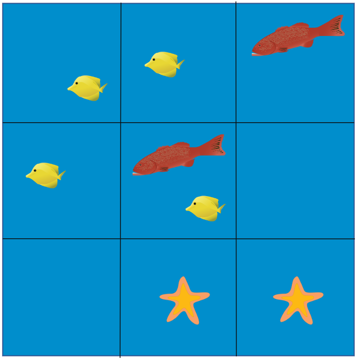
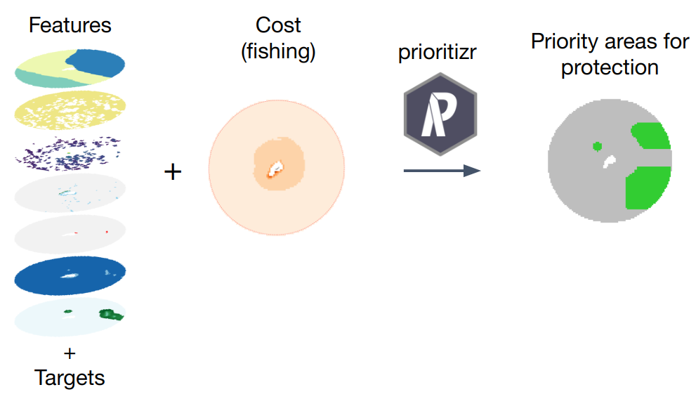

```{r setup, include=FALSE}
knitr::opts_chunk$set(echo = TRUE, collapse = TRUE)
```

## Prerequisites

To follow along, you will need the R packages `terra` and `prioritizr` installed. We will also need a solver that `prioritizr` uses to solve the prioritization problems. For simplicity, we can install the open source solver `lpsymphony`. Finally we will our new package `oceandatr` to get the data for the prioritization. Use the following code to do all the install work.

```{r eval = FALSE}
install.packages("prioritizr")
if (!require(remotes)) install.packages("remotes") #you might already have this: for installing from Github and Bioconductor

remotes::install_bioc("lpsymphony")
options(timeout = 6000) #oceandatr is ~500MB, so need to increase the timeout
remotes::install_github("emlab-ucsb/oceandatr", force = TRUE) #force=TRUE ensures we get the most recent version on Github
```

New we can load the libraries we will need.

```{r load libraries}
library(oceandatr)
library(prioritizr)
```

# Spatial prioritization primer

How do we decide which areas to protect? Or which areas to should be for aquaculture, renewable energy development, or any other use? We need to think about our **spatial priorities**! 

We normally have a set of spatial objectives we want to meet, e.g. protect 50% of all fish spawning grounds, protect 30% of all biodiversity, ensure that 50% of an area remains open to fishing. Lets look at the cartoon example below where the area of the ocean is divided into 9 grid squares (our planning grid), and there are 3 species present. Our objective is to protect 1 representative of each species; simple enough. But we also want to do this using the smallest possible area (minimum grid cells). And how about connectivity; we might want to protect grid cells next to each other. This is simple enough to work through for 9 grid cells and 3 species, but imagine thousands of grid cells and hundreds of species! This is where computer algorithms come in.

```{r fig.width=6, echo=FALSE}

```

We will do a simple spatial prioritization using the `prioritizr` R package. This is widely used for conservation planning and emlab has used it for MPA planning in Bermuda, Montserrat, FSM and Maldives.

# Spatial prioritization recipe

We need 3 things to conduct a basic spatial prioritization using `prioritizr`:

- Planning grid: a grid of cells covering the area where we are doing planning, e.g. an EEZ
- Features: spatial data for things we want to protect, e.g. habitats
- Targets: how much of each feature do we want to protect, e.g. 30% of each habitat
- Cost: spatial data for what we want to minimize impact to. In the ocean, we often use some measure of fishing (e.g. fishing effort or catch value), because we are often interested in minimizing the impact of protected areas to fishing communities.

We can get all the spatial data we need using `oceandatr`.

```{r fig.width=6, echo=FALSE}

```

# Bermuda example

As an example, we will use Bermuda, but the same process can be used for any EEZ or area of the ocean.

## Planning grid

First we need to get the Bermuda EEZ and create a planning grid for it. We are going to create a raster planning grid, but `oceandatr` can also create `sf` grids. When creating the planning grid using the `oceandatr` function `get_grid`, we need to enter a coordinate reference system (crs). An equal area crs is normally best for spatial planning and suitable options can be found using [projection wizard](https://projectionwizard.org).

```{r}
#get the Bermuda EEZ from marineregions.org
bermuda_eez <- get_area(area_name = "Bermuda", mregions_column = "territory1")

#now create a planning grid with 10 km x 10km grid cells, using an equal area crs
planning_grid <- get_grid(area_polygon = bermuda_eez, projection_crs = "+proj=laea +lon_0=-64.8108333 +lat_0=32.3571917 +datum=WGS84 +units=m +no_defs", resolution = 10000)

#lets have a look
terra::plot(planning_grid)
terra::lines(bermuda_eez |> sf::st_transform(sf::st_crs(planning_grid))) #for plotting the outline of the EEZ
```

## Features

Now we can get some features. Remember these are just spatial data for things that we want to protect. There are several sources of data available via `oceandatr` and there is a one stop function that can pull down a standard set of features, representing oceanic habitat types. These are what what emlab have been using for offshore prioritizations.

```{r warning=FALSE}
features <- get_features(spatial_grid = planning_grid) 

#remove all rasters that are only zero (i.e. data is not present)
features <- terra::subset(features, !terra::global(features, "sum", na.rm=TRUE) == 0)

terra::plot(features)
```

## Cost

The cost layer is what we want to minimize impact to. We often use some measure of fishing. Here we will use distance from shore which is a simple proxy of fishing effort for coastal fisheries.

```{r}
#function is from the offshoredatr package
cost <- get_dist_shore(spatial_grid = planning_grid)

terra::plot(cost)
```

# Targets 

We need to tell the prioritization how much of each feature to include in the solution, which is potential areas for protection in our case. We will set a target of 30% for all our features to ensure adequate representation of all habitats.

# Prioritization

Now we can put together our prioritization "problem":

```{r}
prob <- problem(cost, features = features) %>% #setup the problem with cost and features
  add_min_set_objective() %>% #minimum set objective: achieve our objectives at minimum cost
  add_relative_targets(0.3) %>% #30% of each feature must be included in the solution
  add_binary_decisions() %>% #each grid cell is either in or out of the solution
  add_lpsymphony_solver() #the solver to use: can also set add_default_solver() to use the best available on your computer

#solve the problem!
sol <- solve(prob)
```

# Solution

Areas which meet our targets, 30% protection of each feature, at the lowest possible cost, are selected.

```{r}
terra::plot(sol)
terra::lines(terra::as.polygons(features$seamounts), col = "tan") #add outline of seamounts
terra::lines(bermuda_eez |> sf::st_transform(sf::st_crs(planning_grid))) #and the EEZ
```

We can check what percentage of the total area of each feature is represented in the solution: the column on the far right has this information.

```{r}
eval_feature_representation_summary(prob, sol)
```

Can also see how much of the whole planning area (Bermuda's EEZ) is included in the solution

```{r}
#eval_n_summary gives you how many planning units are in the solution. We can then divide this by the total number of planning units
as.numeric(eval_n_summary(prob, sol)[2])/as.numeric(terra::global(planning_grid, "sum", na.rm = TRUE)[1])
```

